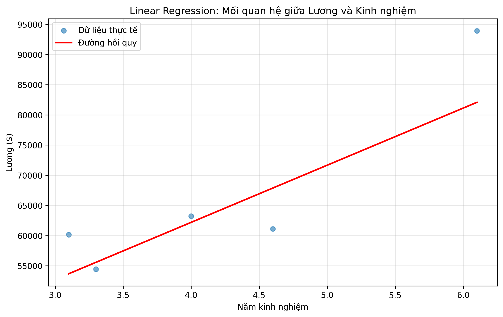

# 📊 Simple Linear Regression - Salary Prediction

Dự án Machine Learning đơn giản sử dụng **Linear Regression** để dự đoán mức lương dựa trên số năm kinh nghiệm.

## 🎯 Mục đích

Project này được tạo ra để:
- Học và thực hành Linear Regression
- Hiểu về Normal Equation
- Xây dựng CLI tool đơn giản với Python
- Phân tích mối quan hệ giữa kinh nghiệm và lương

## 📸 Screenshots

### Kết quả phân tích


### Demo CLI
```bash
$ python cli.py train --plot
==================================================
🚀 BẮT ĐẦU TRAIN MODEL
==================================================
📂 Đang load dữ liệu từ: Salary_dataset.csv
✅ Đã load 30 dòng dữ liệu
📊 Chia dữ liệu...
   Train: 21 | Dev: 4 | Test: 5
🎯 Đang train model...
✅ Trọng số (w): [24320.48  9469.27]
📈 Đánh giá model...
✅ MSE Score: 46,129,192.53
==================================================
```

## 📁 Cấu trúc Project

```
Simple Linear/
├── cli.py                  # CLI tool chính
├── Main.py                 # Script gốc (demo)
├── Salary_dataset.csv      # Dataset
├── requirements.txt        # Dependencies
├── README.md              # File này
└── .gitignore             # Git ignore rules
```

## 🚀 Cài đặt

### 1. Clone repository

```bash
git clone <your-repo-url>
cd "Simple Linear"
```

### 2. Cài đặt dependencies

```bash
pip install -r requirements.txt
```

hoặc với pip3:

```bash
pip3 install -r requirements.txt
```

## 💻 Sử dụng

### CLI Tool

#### Train Model và hiển thị kết quả

```bash
python cli.py train --data Salary_dataset.csv --plot
```

Output:
```
==================================================
🚀 BẮT ĐẦU TRAIN MODEL
==================================================
📂 Đang load dữ liệu từ: Salary_dataset.csv
✅ Đã load 30 dòng dữ liệu
📊 Chia dữ liệu...
   Train: 21 | Dev: 4 | Test: 5
🎯 Đang train model...
✅ Trọng số (w): [25792.2, 9449.96]
📈 Đánh giá model...
✅ MSE Score: 31,270,625.48
📊 Đang tạo biểu đồ...
✅ Biểu đồ đã được lưu tại: regression.png
==================================================
✅ HOÀN THÀNH!
==================================================
```

#### Dự đoán lương cho số năm kinh nghiệm cụ thể

```bash
python cli.py predict --years 5 --data Salary_dataset.csv
```

Output:
```
==================================================
🔮 DỰ ĐOÁN LƯƠNG
==================================================
📊 Năm kinh nghiệm: 5
💰 Lương dự đoán: $73,042.20
==================================================
```

#### Hiển thị help

```bash
python cli.py --help
python cli.py train --help
python cli.py predict --help
```

### Script gốc (Main.py)

Chạy script demo ban đầu:

```bash
python Main.py
```

⚠️ **Lưu ý**: Cần sửa đường dẫn trong `Main.py` từ `AI/Salary_dataset.csv` thành `Salary_dataset.csv`

## 📊 Dataset

File `Salary_dataset.csv` chứa dữ liệu về:
- **YearsExperience**: Số năm kinh nghiệm làm việc
- **Salary**: Mức lương tương ứng (USD)

Dataset được chia thành:
- 70% Training set
- 15% Development set  
- 15% Test set

## 🧮 Thuật toán

Project sử dụng **Normal Equation** để tính trọng số tối ưu:

```
w = (X^T X)^(-1) X^T y
```

Trong đó:
- `X`: Ma trận features (có thêm bias column)
- `y`: Vector target (salary)
- `w`: Vector trọng số (weights)

## 📈 Đánh giá Model

Model được đánh giá bằng **MSE (Mean Squared Error)**:

```
MSE = (1/n) Σ (y_actual - y_predicted)²
```

## 🛠️ Technologies

- **Python 3.x**
- **pandas**: Xử lý dữ liệu
- **numpy**: Tính toán ma trận
- **matplotlib**: Vẽ biểu đồ
- **argparse**: Xây dựng CLI

## 📝 TODO

- [ ] Thêm validation metrics (R², RMSE)
- [ ] Implement Gradient Descent để so sánh
- [ ] Thêm feature scaling
- [ ] Tạo web interface đơn giản
- [ ] Thêm unit tests

## 🤝 Contributing

Mọi đóng góp đều được chào đón! Hãy tạo Pull Request hoặc mở Issue nếu bạn có ý tưởng cải thiện.

## 📄 License

MIT License - Xem file [LICENSE](LICENSE) để biết thêm chi tiết.

## 👤 Author

**Your Name**
- GitHub: [@yourusername](https://github.com/yourusername)
- Email: your.email@example.com

## 🙏 Acknowledgments

- Dataset từ [nguồn dataset của bạn]
- Inspired by Andrew Ng's Machine Learning course

---

⭐ Nếu project này hữu ích, hãy cho một star nhé!
